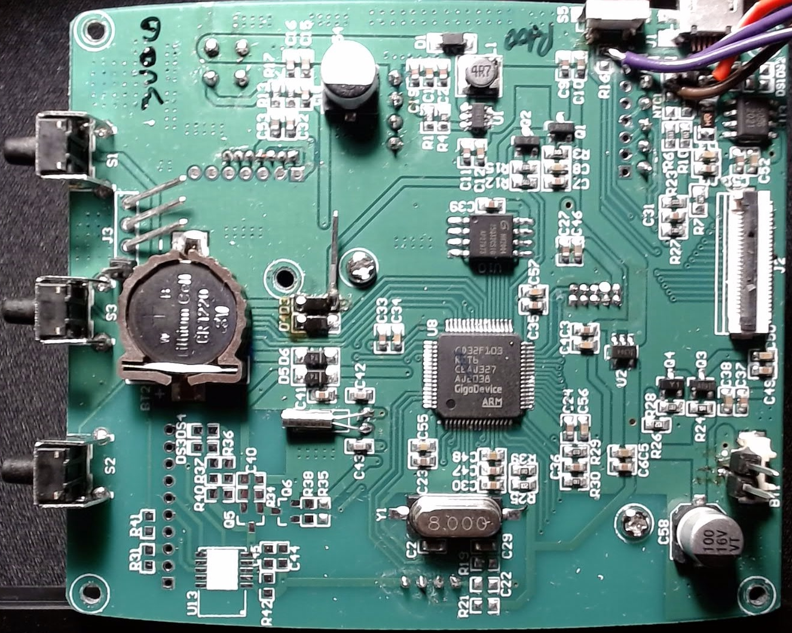
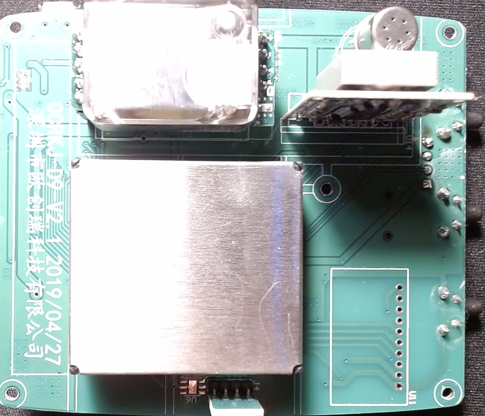
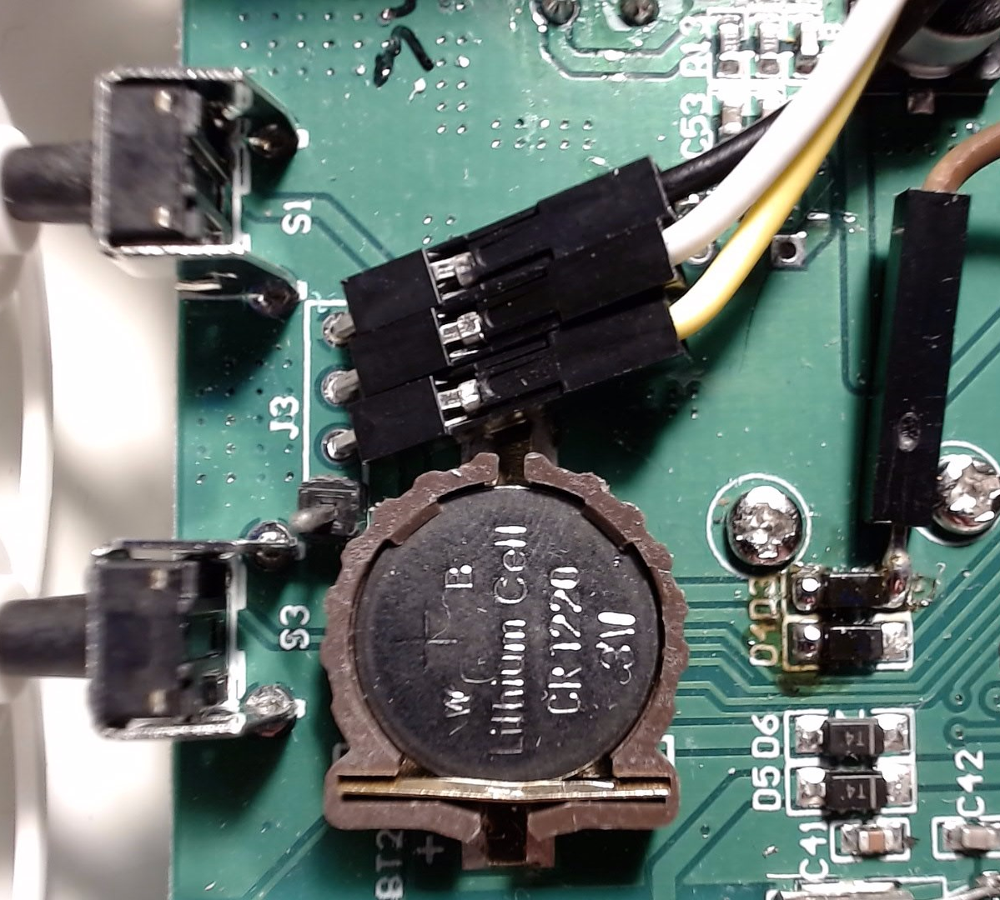
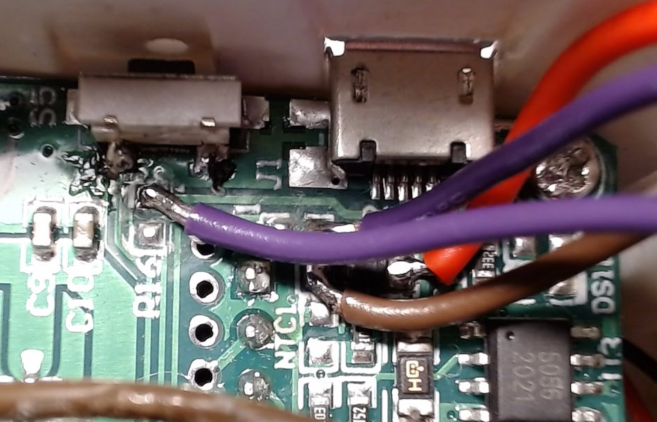
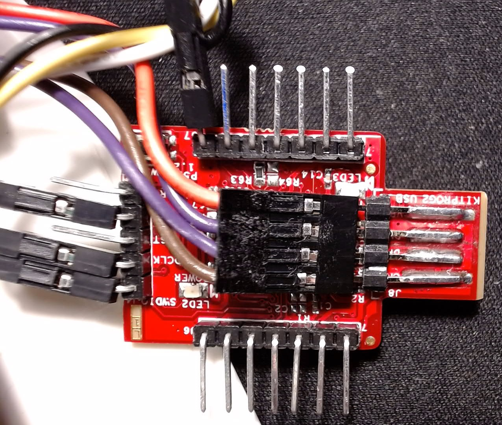

# What?
HomeAssistant integration of a [rebranded](https://www.amazon.de/gp/product/B08MT2RSFM/ref=ppx_yo_dt_b_asin_title_o04_s01?ie=UTF8&psc=1) Air quality meter (AHQI) designed by [OCRKJ](http://www.ocrkj.com/productinfo/770304.html) as with model number 'D9'.  
Although the documentation focuses on this product, the steps taken to integrate could be applied to other devices as well.
 
# Why?
By design, the device is a standalone equipment, integrating multiple sensor (temperature, humidity, TVOC, HCHO, PM2.5, PM10, CO2) measurements that are displayed on the integrated LCD.  
It includes several display modes (such as graphing) and a internal flash memory for manual saving/reading of measurement samples.  
Hardware-wise, the device has no external connection - the USB port is only for charging, and there's no internal wireless interface (WiFi, BT, or even BT).  
As such, no direct solution regarding third-party integration is readily available - the information contained in this repo is obtained via reverse-engineering efforts.  

# How?

## 1. Implement an external interface
Since reverse-engineering software may pose a infringement on copyrights, no binary files or dissasembly workspaces data is included in this repo.  
Instead, it is fully up to the responsibility of the user whether to reproduce the results.  

### 2.1. Extract the firmware
- By analysing the PCB inside the device, several components can be identified: a [GD32F103](https://www.gigadevice.com/products/microcontrollers/gd32/arm-cortex-m3/mainstream-line/gd32f103-series/) MCU (clone of a [STM32F103](https://www.st.com/en/microcontrollers-microprocessors/stm32f103rc.html)), several athmospheric sensors with no clear markings, a socketed battery, LCD screen connector, and miscellaneous circuits (power, clocking). The cables soldered are part of the hardware modifications covered in this repo.  
<br>
<br>
- A footprint for a wireless (WiFi?) module and can be seen - due to no digital activity on all of the pins, it can be concluded that this feature is neither implemented in HW nor in SW. 
- Although the USB socket has the data pins connected to the MCU, the deviced does not enumerate when connected to a host PC.  
- One connector on the top-right, identifiable as a SWD debug interface (pinout from the left: `VCC`, `SWCLK`, `SWDIO`, `GND`), may prove to be the only solution to integrating the device in a HA instance.  
- As expected, any attempt to read out the flash memory is blocked by means of a active [readout protection (RDP)](https://www.st.com/content/ccc/resource/training/technical/product_training/b9/d2/34/3a/59/45/47/45/STM32L4_System_Memory_Protections.pdf/files/STM32L4_System_Memory_Protections.pdf/jcr:content/translations/en.STM32L4_System_Memory_Protections.pdf) mechanism. Fortunately, the level set by the manufacturer is 1, so SWD connection is still possible.  
- Since the GD(STM)32F103 is a popular entry-level MCU, there's a number of known RDP vulnerabilities documented, for eg. [{1}](https://hackaday.com/2020/03/24/breaking-into-a-secure-facility-stm32-flash/) and [{2}](https://prog.world/read-secure-firmware-from-stm32f1xx-flash-using-chipwhisperer/).  
- One paper published by [Johannes Obermaier, Marc Schink, and Kosma Moczek](https://www.usenix.org/conference/woot20/presentation/obermaier) covers the GD32F103 clone in particular. Several approaches are taken in extracting the flash memory contents, the fastest being a DMA-based transfer (chapter 6.5.) - blocks of the flash memory are copied to RAM via DMA requests, then saved on the host PC (RDP doesn't protect RAM readout).  
- While RDP prevents flash read operations, the running software also employs protection against debugging by polling the `Debug Halting Control and Status Register` (DHCSR) register, in particular the `C_DEBUGEN` bit that is usually set when a external debugger connects to the MCU - a value of 1 triggers a soft reset that hinders running the exploit.  
- Segger's [J-Link EDU](https://www.segger.com/products/debug-probes/j-link/models/j-link-edu/)  debugger and [J-Link Commander] (https://www.segger.com/products/debug-probes/j-link/tools/j-link-commander) CLI were used.
- After connecting the debugger to the board and enabling debug mode, the MCU will, as expected, reset continuously - clearing the `C_DEBUGEN` bit will prevent this - in J-Link Commander run `Write4 0xE000EDF0 0xA05F0000`, then hardware reset the device via the small button on the right.  
- Once the device no longer resets itself, the firmware can be easily extracted by following the steps in the [paper](docs/paper).  
- To ease generating the necessary commands, run the script [`jlink_cmd_gen.py`](scripts/jlink_cmd_gen.py) - if necessary, modify the `RAM_SIZE` and `ROM_SIZE` accordingly to the target MCU.  
- Copy-paste the contents of the resulting file [`output/jlink_cmd_gen.txt`](scripts/output/jlink_cmd_gen.txt) into the J-Link Commander window - a number of binary files shall be saved in the same folder.  
- Run the script [`jlink_bin_merge.py`](scripts/jlink_bin_merge.py) to merge all the binary files into a single file [`full_rom_dump.bin`](scripts/output/full_rom_dump.bin).  

### 2.2. Analyse the extracted firmware
- To disassemble the file, [Ghidra](https://github.com/NationalSecurityAgency/ghidra) will be used, as it is the best (and free) solution currently available.  
- Create a new project, and import the [`full_rom_dump.bin`](scripts/output/full_rom_dump.bin) file as a `ARM v7 little endian` binary image, assigning the block name `ROM` and startup address `0x8000000`.
- Open the imported file in Ghidra's CodeBrowser, then open the `Memory Map` window avaiable in the `Window` drop-down menu.  
- Define a new memory block named `RAM`, with start address `0x20000000` and flags `read`, `write`, and `volatile` checked.  
- Run a `Analyze all open...` from the `Analysis` drop-down menu.  
- Once dissasembly is finished, click on the `RAM` block from the top-left `Program Tree` view - it should contain a number of variable blocks with names starting with `DAT_200`.  
- From the `File` drop-down menu, click `Export Program...`, select format as `XML`, then check **at minimum** the `Data` checkbox in the `Options...` menu. Save the file as [`full_rom_dump.xml`](scripts/output/full_rom_dump.xml) in the [`output`](scripts/output) folder.  
- The resulting XML file contains the addresses and sizes of all the constants and variables detected by the decompiler.  
- While the MCU is running, dump the current RAM contents - in J-Link Commander run `SaveBin XX\ram_dump_Y.bin, 20000000, BFFF`, where `XX` is the absolute path to the [`output`](scripts/output) folder, and `Y` the current dump id (starting from 1). Take note during dump operation of the current measurement values displayed on the D9's LCD screen.  
- To ease up the identification process, take multiple RAM dumps, while incrementing the file name's ID, for eg. `ram_dump_1.bin`, `ram_dump_2.bin`, etc.  
- Run the script [`xml_addr_dump.py`](scripts/xml_addr_dump.py) to extract the values stored at known RAM addresses (based on the XML file previously generated) that are valid (i.e. the bits are not all 0 or all 1).  
- A table will be displayed with the addresses and sizes of valid values found in the RAM dump(s), togheter with displaying the values in unsigned/signed, decimal/hexadecimal, and float formats.  
- If multiple RAM dump files are found, the displayed table will only include addresses that contain valid values in all the dumps, thus further removing false positives.  
- For example, a table obtained from two RAM dumps will have the following header:  
`| ID     ADDR   SIZE |     UNSIGNED_DEC    UNSIGNED_HEX    SIGNED_DEC  UNSIGNED_HEX  FLOAT   |  UNSIGNED_DEC    UNSIGNED_HEX    SIGNED_DEC  UNSIGNED_HEX  FLOAT   |`, with a row containing a signed 2-byte value displayed as:  
`| 302   0x20006f0e  2  |   62400        0xf3c0        -3136        -0xc40                    | 62400        0xf3c0        -3136        -0xc40                    |`    
- To identify the addresses where the sensors measurements are stored, compare the value displayed on the D9's screen with the ones displayed in the table (for eg. the temperature is 23.4°C, so a variable could contain value `d234`).  
- By following the steps described, it was concluded that the target adresses are:  
	- `0x20000078` for TEMP in 0.1 °C resolution,  
	- `0x2000007a` for HUMID in 0.1 %,  
	- `0x20000086` for PM25 in 1 ug/m^3,  
	- `0x20000088` for PM10 in 1 ug/m^3,  
	- `0x200000ca` for CO2 in 1 ppm,  
	- `0x200000f6` for HCHO in 0.001 ppm,  
	- `0x20000116` for TVOC in 0.001 mg/m^3.


### 2.3. Sampling the measurement values
- Once the RAM addresses and sizes of the measurement values are determined, they can be read anytime during normal MCU runtime.  
- A [PyOCD-compatible](https://pyocd.io/docs/debug_probes.html) Kitprog2/3 debug probe was used in CMSIS-DAP mode, due to its several advantages (size, reliability, cost) - it may be required to [update to the latest firmware](https://github.com/Infineon/Firmware-loader). 
- The Kitprog's SWD lines (`GND`, `SWCLK`, `SWDIO`) are connected to the D9 debug connector, while the USB power/data lines are connected directly to the D9's micro-USB socket - remove resistors `R11` and `R16`.  
- These changes allow powering both the target device and probe from the same USB connection, and integrating the probe inside the case, thus retaining the overall design estetics.  
- To prevent any hardware shutdown that will then require physically pushing the power button to restart, connect the anode of diode `D3` to `GND`.  
<br>

<br>
- Once hardware setup is complete, the D9 can be connected to the host PC via it's USB socket, now enumerating as a CMSIS-DAP device.  
- Debug operations, such as reading RAM/ROM memory contents, can be accomplished with any compatible software, notably [PyOCD](https://pyocd.io/).  

## 3. Configure the data relay
Since the Python script relies on non-standard libraries, a [Home Assistant Docker installation](https://www.home-assistant.io/installation/linux#install-home-assistant-container) is assumed to be already working.  
Also, a MQTT broker (for example Mosquitto) is also [installed](https://mosquitto.org/download), [configured](https://mosquitto.org/man/mosquitto-conf-5.html) and [accesible in HA](https://www.home-assistant.io/docs/mqtt/broker).  

- Install the required python libraries: `sudo pip install paho_mqtt pyocd`.  
- Edit the [`mqtt_d9.py`](scripts/mqtt_d9.py) file by configuring the user-specific values for the used MQTT broker (`MQTT_HOSTNAME`, `MQTT_USERNAME`, `MQTT_PASSWORD`, `MQTT_CLIENT_ID`), and sampling period (`SAMPLE_INTERVAL`).  
- Run the Python script as root: `sudo python3 mqtt_d9.py`.  
- (Optional) Configure the script to run at startup, for example by adding it to `/etc/rc.local`.  

## 4. Configure the HomeAssistant instance
- Add the following lines in `configuration.yaml` file (present inside the user-defined `homeassistant` configuration folder).  
Take note of the `state_topic` value, where `d9` is a example that shall be subtituted with the exact value of `MQTT_CLIENT_ID` parameter set at step 3.  

```
sensor:
  - platform: mqtt
    name: TEMP
    unique_id: "d9_temp"
    state_topic: "d9/sensors/TEMP"
    device_class: temperature
    unit_of_measurement: "°C"
  - platform: mqtt
    name: HUMID
    unique_id: "d9_humid"
    state_topic: "d9/sensors/HUMID"
    device_class: humidity
    unit_of_measurement: "%"
  - platform: mqtt
    name: PM25
    unique_id: "d9_pm25"
    state_topic: "d9/sensors/PM25"
    device_class: pm25
    unit_of_measurement: "ug/m³"
  - platform: mqtt
    name: PM10
    unique_id: "d9_pm10"
    state_topic: "d9/sensors/PM10"
    device_class: pm10
    unit_of_measurement: "ug/m³"
  - platform: mqtt
    name: CO2
    unique_id: "d9_co2"
    state_topic: "d9/sensors/CO2"
    device_class: carbon_dioxide
    unit_of_measurement: "ppm"
  - platform: mqtt
    name: HCHO
    unique_id: "d9_hcho"
    state_topic: "d9/sensors/HCHO"
    device_class: volatile_organic_compounds
    unit_of_measurement: "mg/m³"
  - platform: mqtt
    name: TVOC
    unique_id: "d9_tvoc"
    state_topic: "d9/sensors/TVOC"
    device_class: volatile_organic_compounds
    unit_of_measurement: "mg/m³"
```
- If all is well, after a HA restart the newly created sensors shall be available.

# Who/where/when?
All the reverse-engineering, development, integration, and documentation efforts are based on the latest software and hardware versions available at the time of writing (February 2022), and licensed under the GNU General Public License v3.0.
